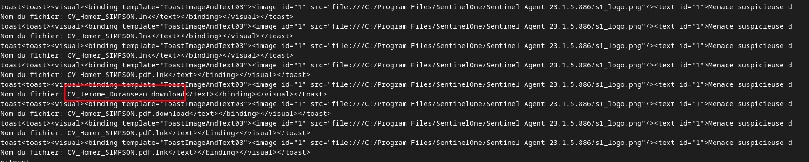
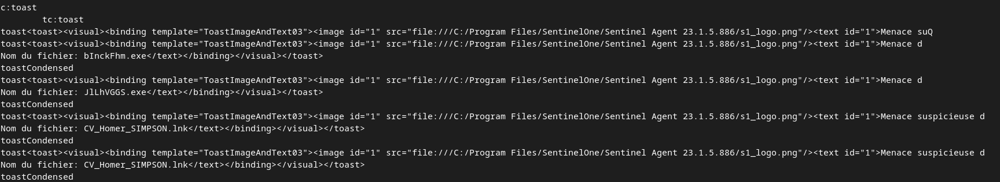
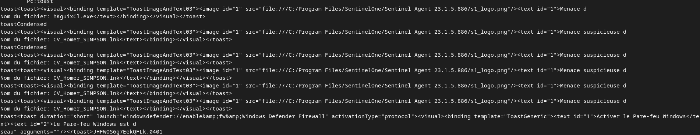
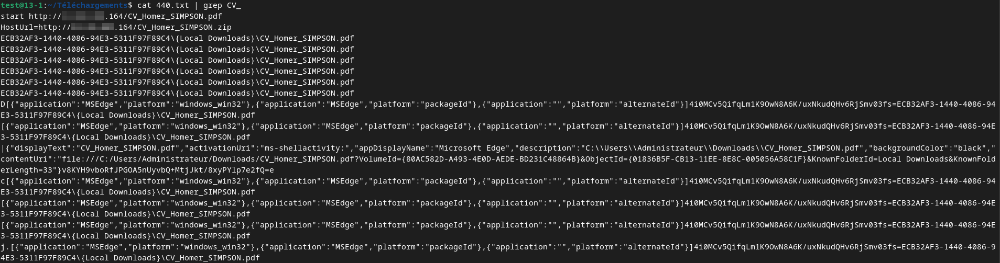
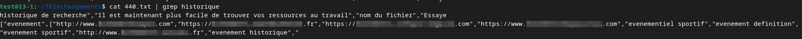
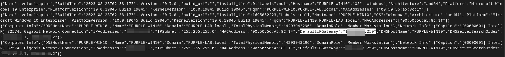

# Endpoint and EDR forensics

Analysis of a compromised Windows workstation (`PURPLE-WIN10`, domain `PURPLE-LAB.local`) where a user was tricked into downloading malicious files disguised as CVs. The investigation combined EDR alerts (SentinelOne), host collection (Velociraptor), and memory string analysis. Hostnames and users are fictional lab personas.

## Detection: EDR alerts

SentinelOne (Sentinel Agent 23.1.5.886) raised suspicious-threat alerts on several files disguised as job applications and on two dropped executables:

The attacker also attempted to weaken the host by disabling the Windows Defender firewall, which the EDR surfaced as well:

## Initial access: malicious download

Memory string analysis of the host (searching the acquired image) showed the user downloading a booby-trapped `CV_*.pdf` (and a matching `.zip`) through Microsoft Edge from an external attacker server into the Administrator's Downloads folder. The shellbag and jumplist artifacts confirmed the file path and activity.

The browser search and download history gave further context on the user's activity before the compromise:

## Host collection with Velociraptor

A Velociraptor agent was deployed to collect host artefacts (system info, network configuration, processes, event logs). The host details confirmed the machine identity and network placement:

Collected evidence included the Windows event logs (`Security.evtx`, `System.evtx`, `Powershell.evtx`), Sysmon configuration, and a `CVE-2021-1675` (PrintNightmare) proof-of-concept script left on the desktop, pointing to an attempted local privilege escalation.

## Takeaways

- The intrusion started with a social-engineering download (fake CV), which an EDR flagged in real time.
- The attacker tried to disable host defenses (firewall) and staged a known privilege-escalation exploit (PrintNightmare).
- Combining EDR telemetry, host collection, and memory artefacts rebuilt the chain from initial download to attempted escalation.
