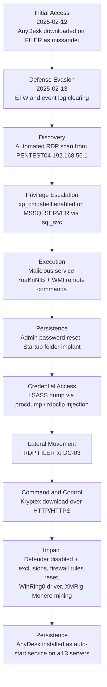

# Forensic investigation: ESSOS crypto-mining intrusion

Full forensic analysis carried out by ZCorp after ESSOS detected a compromise on its infrastructure.

## Summary

On 19 May 2025, ESSOS IT noticed two unexpected application icons on the desktop of the main domain controller: **AnyDesk** (remote control) and **Kryptex** (crypto-mining). ESSOS engaged ZCorp for a forensic investigation and provided disk images of three suspect virtualized servers:

- **DC-03**: main Active Directory domain controller (Windows Server 2016)
- **FILER**: internal file server (Windows Server 2019)
- **MSSQLSERVER**: SQL database server (Windows Server 2016)

Analysis of logs and system artefacts traced suspicious activity back to **February 2025**, well before the May discovery, indicating a stealthy compromise followed by an exploitation phase.

The investigation covered three goals: identify traces of compromise, rebuild the attack timeline, determine the intrusion vectors and techniques, assess the scope and impact, and produce remediation recommendations.

## Tools

- **Velociraptor**: agents deployed on the analyzed machines to collect a wide range of Windows artefacts (logs, registry, services, processes, network connections).
- **Hayabusa** (integrated with Velociraptor): automatic detection of suspect events from Windows Event Logs using a MITRE ATT&CK based rule set.
- Supporting tools for log parsing, timeline visualization, and memory dump interpretation.

## Assets in scope

| Asset | Type | Note |
|-------|------|------|
| DC-03 | Windows domain controller | Windows Server 2016 |
| FILER | Windows file server | Windows Server 2019 |
| MSSQLSERVER | Windows SQL server | Windows Server 2016 |
| Administrator | AD admin account | Domain admin |
| sql_svc | AD service account | SQL service, on all three servers |
| vagrant | Local admin account | On all three machines |
| missandei | AD user | On FILER and MSSQLSERVER (possible lateral movement / credential reuse) |
| PENTEST04 | Linux host | Suspect hostname in FILER logs |
| grv1pq2ilw@zlorkun.com | AnyDesk account | Attacker remote access account |

## Attack timeline (MITRE ATT&CK)

Key events:

| Time (2025) | Phase | Event |
|-------------|-------|-------|
| 02-12 15:13 | Initial Access | AnyDesk.exe downloaded on FILER via Firefox under `missandei` (confirmed in `places.sqlite`), then via Administrator |
| 02-13 10:31 | Defense Evasion | ETW traces cleared (`wevtutil`), System and PowerShell logs purged |
| 02-13 10:32 | Discovery | Repeated and automated RDP connections from PENTEST04 (192.168.56.1) to DC-03 and FILER:3389 |
| 02-13 10:32-10:38 | Privilege Escalation | `xp_cmdshell` enabled on MSSQLSERVER (`sp_configure 'xp_cmdshell',1; RECONFIGURE;`) under `sql_svc` |
| 02-13 10:40 | Execution | Malicious service `7oaKnNIB` created via a CMD one-liner pointing to a `.ini` in `C:\Windows\Temp` |
| 02-13 10:42 | Execution | WMI remote execution: `net localgroup`, add `missandei`, reset an admin password, read `sql_conf.ini` |
| 02-13 10:43 | Persistence | Administrator password reset (`net user administrator Password123!`) |
| 02-13 10:46 | Defense Evasion | Microsoft Defender disabled via registry (`DisableAntiSpyware`, `DisableRealtimeMonitoring`) |
| 02-13 10:47 | Lateral Movement / Persistence | RDP FILER to DC-03, Startup folder implant with `desktop.ini` |
| 02-13 10:49 | Credential Access | `tasklist` to find LSASS, then `procdump.exe -ma <PID>` LSASS dump (rdpclip.exe injection into lsass.exe) |
| 02-13 10:56 | Command and Control | Kryptex downloaded over HTTP/HTTPS (Azure and Akamai fronted domains) |
| 02-13 10:57 | Impact | Defender exclusions added (`Add-MpPreference -ExclusionPath`), firewall rules reset (`netsh advfirewall`) |
| 02-13 10:58 onward | Impact | XMRig Monero miner launched on multiple pools, WinRing0x64.sys vulnerable driver loaded as a kernel service |
| 02-13 11:06 | Persistence | AnyDesk installed as an auto-start system service on all three servers |

## Indicators of compromise (selection)

- **xp_cmdshell** enabled under `ESSOS\sql_svc` for command execution from the SQL engine.
- **AnyDesk**: port 7070 (TCP/UDP), relays `boot.net.anydesk.com` and `relay-*.net.anydesk.com`, account `grv1pq2ilw@zlorkun.com`.
- **LSASS credential theft**: `rdpclip.exe` injected into `lsass.exe`, LSASS dumped with procdump, possible LaZagne/Mimikatz use.
- **Defender tampering**: registry keys `DisableAntiSpyware` / `DisableRealtimeMonitoring`, and `HKLM\SOFTWARE\Microsoft\Windows Defender\Exclusions\Paths` for the Kryptex folders.
- **Miner**: `WinRing0x64.sys` loaded as service `WinRing0_1_2_0`, `kryptex_xmrig.exe` connecting to mining pools.
- **Log clearing**: `wevtutil el | foreach { wevtutil cl $_ }`.
- **RDP**: port 3389 used for lateral movement.

## Immediate measures

- Network blocking of AnyDesk and Kryptex traffic via the firewall.
- Identification of the unknown host PENTEST04, not in the ESSOS inventory.
- Targeted eradication of AnyDesk and Kryptex after forensic copies were taken.
- Personal data breach declared to the CNIL (GDPR article 33), affected people notified.
- Incident reported to the ANSSI and a complaint filed with the C3N (cybercrime unit).
- Degraded-mode restart of critical services with the regional CSIRT.
- Reset of all potentially compromised passwords.

## Remediation

**Short term**: robust 3-2-1 backup plan (local, remote/cloud, offline air-gapped) with integrity and restore testing, plus security awareness training (phishing, digital hygiene), controlled intrusion exercises, and a business RETEX to close unnecessary flows and services.

**Medium and long term**: a wider forensic sweep of the estate, a Business Continuity Plan (targeted network isolation rather than shutdown, crisis cell, out-of-band communication), a Disaster Recovery Plan (restore from clean backups, offline standby servers), infrastructure hardening (least privilege, network access control, patching, physical security), and 24/7 SOC monitoring with hot and cold incident response and alert correlation.

## Quote (remediation options)

| Item | Unit | Qty | Total (EUR) |
|------|------|-----|-------------|
| BCP (PCA) | 200/machine | 3 | 600 |
| DRP (PRA) | 1500/machine | 3 | 4500 |
| NAC | 1200/subnet | 1 | 1200 |
| Cloud backups | 30/GB | 300 | 9000 |
| Awareness / workshops | 300/day | 5 | 1500 |
| Service hardening | 4000/machine | 4 | 16000 |
| Service restoration | 1500/machine | 3 | 4500 |
| SOC | 6000/year | 3 | 18000 |

## Conclusion

The intrusion into the ESSOS information system was confirmed, with activity dating back to February 2025. The system was partially restored and runs in degraded mode, but the scope suggests the attacker may still be present, so a wider forensic investigation is recommended.
