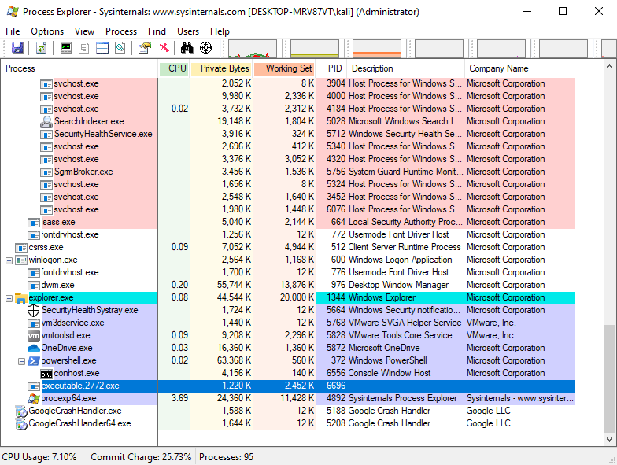
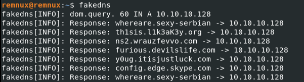
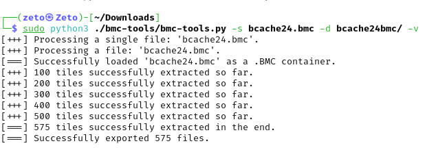
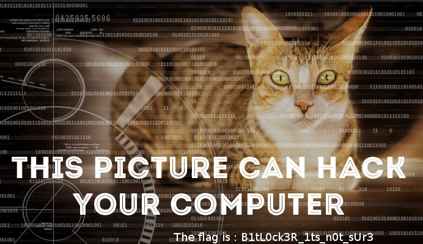
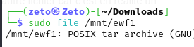

# Memory and disk forensics with Volatility

Write-up of memory forensics challenges (Command and Control series) and disk image challenges, using Volatility 2 and 3 on memory dumps and E01 disk images. Hostnames and users are fictional (for example "John Doe").

## Command and Control: memory dump analysis

### Identify the host

```bash
vol -f ch2.dmp windows.registry.printkey --key "ControlSet001\Control\ComputerName\ComputerName"
```

Volatility 3 (`vol`) reads the dump (`-f`) and prints the registry key holding the computer name. Result: `WIN-ETSA91RKCFP`.

### Find the suspicious process

```bash
vol -f ch2.dmp windows.pslist  > malware.txt
vol -f ch2.dmp windows.pstree >> malware.txt
```



Two Internet Explorer processes appear. One runs from the `Quick Launch` directory and spawns a CMD, which is abnormal, so it is the suspect. The suspicious path is hashed:

```
C:\Users\John Doe\AppData\Roaming\Microsoft\Internet Explorer\Quick Launch\iexplore.exe
-> 49979149632639432397b3a1df8cb43d
```

### Analyze the command and network behavior (Volatility 2)

```bash
python2 ./volatility/vol.py -f ch2.dmp --profile=Win7SP1x86_23418 cmdline | grep iexplore.exe
python2 ./volatility/vol.py -f ch2.dmp --profile=Win7SP1x86_23418 consoles
```

`conhost.exe` launched `tcprelay.exe` through CMD, which is abnormal (it should launch `conhost.exe`). `tcprelay.exe` forwards packets to another destination. The process memory is dumped and searched:

```bash
python2 ./volatility/vol.py -f ch2.dmp --profile=Win7SP1x86_23418 memdump -p 2168 --dump-dir ./
strings 2168.dmp | grep tcprelay
```

The process forwards packets from `192.168.0.22:3389` (RDP) to `yourcsecret.co.tv:443` (HTTPS, to hide the malicious traffic). A local fake DNS confirms the malicious domains resolving to the attacker host:



### Recover credentials

```bash
vol -f ch2.dmp windows.hashdump
```

NTLM hashes are recovered; Guest and Administrator are empty, but John Doe's is not. It is cracked with Hashcat and rockyou:

```bash
echo "b9f917853e3dbf6e6831ecce60725930" > hash.txt
hashcat -m 1000 hash.txt ./rockyou.txt
```

Password found: `passw0rd`.

## Disk image challenges (E01)

### RDP bitmap cache

After verifying the file hash against the client-provided hash, the E01 image is mounted and found to be a TAR archive, which is decompressed to reveal a BMC (Bitmap Cache) file. Using `bmc-tools`, 575 `.bmp` files are extracted, and scrolling through them reveals the flag.





### BitLocker key extraction



The E01 image is mounted, and the `ewf1` disk image (a compressed TAR) is copied out. The image contains a BitLocker-encrypted volume. With Volatility 2 and the `bitlocker` plugin, the FVEK and Tweak keys are recovered:

```
FVEK  : e7e576581fe26aa7c71a7e711c778da2
Tweak : b72f4e075edb7e734dfb08638cf29652
```

The FVEK is the symmetric key used for encryption and decryption. It is combined with the Tweak key to add entropy so identical data patterns do not repeat across the disk (similar in spirit to a salt).

The target partition is carved out with `dd`:

```bash
dd if=image.dd of=bitlocker_partition.img bs=512 skip=128 count=147456
```

`bs=512` sets the block size, `skip=128` starts after 128 sectors, and `count=147456` copies that many sectors. The BitLocker partition is then mounted with the FVEK:Tweak key:

```bash
dislocker -k <FVEK>:<Tweak> ... /mnt/bde
```

The decrypted partition is explored, and `flag.jpg` is recovered.
